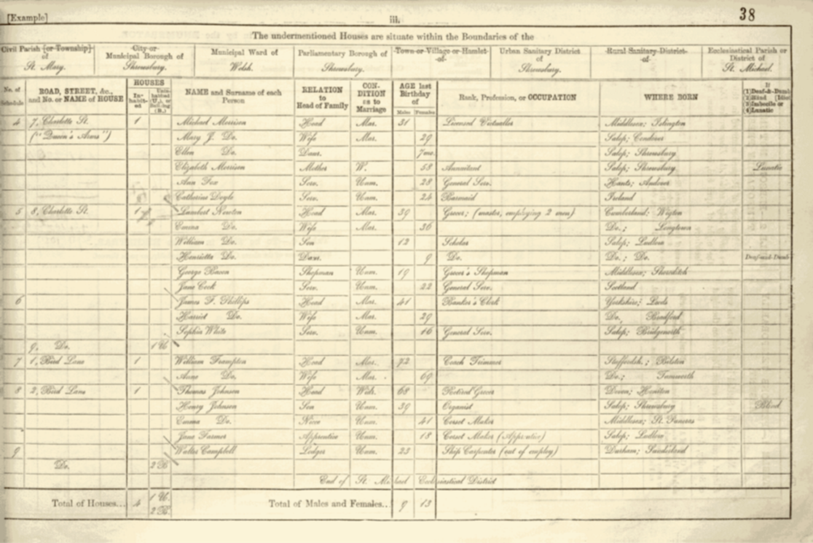

## Technological Change & Labour Markets  
<!-- Research Entry 1 -->

  

    
  

  

    <h4><a href="https://github.com/HillaryVipond/JMP"><strong>Technological Unemployment in Victorian Britain: A Tasks-Based Approach</strong></a> </h4>

    
Hillary Vipond (JMP)

    
There is no quantitative record of jobs lost to, and generated by, creative destruction as industries mechanized in Great Britain over the 19th century. Such a record would enable a long-run view of the impact of occupational decline, adding a dimension to debates on the future of work.

    
I create a new, sub-industry level of occupation for England between 1851–1911, using text recorded in individual-level English census observations, as digitized by the Integrated Census Microdata project (ICeM). I focus on the impact of mechanization on the bootmaking industry and assign 1.3 million English bootmakers to the sub-industry "tasks" they performed.

    
I show that technological unemployment, obscured at an industry-level analysis, is revealed at the task level. In bootmaking, the occupational structure was transformed as the industry mechanized. Approximately <strong>152,000 jobs disappeared</strong> as skills became obsolete, while <strong>144,000 new jobs</strong> demanding different skills emerged. These new jobs went almost entirely to young bootmakers, while incumbents did not transition into the new employment opportunities.

    
This was not a case of widespread labor displacement—rather, incumbents were "grandfathered out." The technological shock primarily reshaped the <strong>matrix of employment opportunities available to young people</strong>.

  

<!-- Research Entry 2 -->

  

    
  

  

    <h4><a href="https://jkastis.github.io/yanniskastis/Kastis_JMP.pdf"><strong>Organizational Practices and Technology Adoption:
Evidence from Jewish Immigration and the Tailoring Industry in England</strong></a></h4>
    
<strong>Yannis Kastis (JMP), Hillary Vipond</strong>

    
This paper provides causal evidence on the role of organizational practices in driving technology adoption. We examine a shift in practices in the English tailoring
industry, prompted by the arrival of Jewish immigrant tailors who fled pogroms in the Russian Empire between 1881 and 1905. By the time Jewish tailors arrived in
England, garment production was predominantly bespoke and native tailors were using sewing machines - introduced in the 1860s - to increase individual productivity. In Russia, where sewing machines were unavailable, Jewish tailors specialized in ready-to-wear production, which involved a greater division of labor into specialized tasks than bespoke work. Upon arriving in England, they combined the available sewing machines with their organizational practice to scale up ready-to-wear production. Using original data on production tasks and firm-level data, we study
how this shift influenced the adoption of the sewing machine and the transition to mass production of garments in England. Our findings show that organizational practices are instrumental in integrating new technologies into production.
 

  

<!-- Research Entry 3 -->

  

    
  

  

    <h4><a href="https://www.cesifo.org/en/publications/2023/working-paper/past-and-future-work-how-history-can-inform-age-automation)4"><strong>The Past and Future of Work: How History Can Inform the Age of Automation </strong></a></h4>
    
<strong>Ben Schneider, Hillary Vipond</strong>

    
Debates about the future of work frequently reference past instances of transformative innovation to preface analysis of how automation and artificial intelligence could reshape society and the economy. However, technological shifts in history are rarely considered in depth or used to improve predictions and planning for the coming decades. In this paper we show that a deeper understanding of history can expand knowledge of possibilities and pitfalls for employment in the future. We open by demonstrating that evidence from historical events has been used to inform responses to present-day challenges. We argue that history provides the only way to analyze the long-term impacts of technological change, and that the scale of the First Industrial Revolution may make it the only precedent for emerging transformations. Next, we present an overview of the current debates around the potential effects of impending labor-replacing innovation. We then summarize existing historical research on the causes and consequences of technological change and identify areas in which salient historical findings are overlooked. We close by proposing further research into past technological shocks that can enhance our understanding of work and employment in an automated future.

  

<!-- Research Entry 5 -->

  

    
  

  

    <h4><strong>Census Linking: Confidence in the Absence of Ground Truth</strong></h4>
    
<strong>Hillary Vipond</strong>

    

      Linking historical census datasets faces significant challenges. The first order issue is the
risk of false positives, which can distort key downstream coefficients of interest, particularly for migration and occupation. These errors then result in incorrect conclusions
being drawn in new research in economic history. In this paper, I propose an approach which makes it possible to assess the share of false positives in panel datasets generated
by any given linking algorithms. It does not require ground truth data. Instead, it exploits systematic biases induced by false positives in outcomes of interest to construct a
litmus testing process. Using this framework, I take a multi-model comparison approach to explore the impacts of model specification choices on the linked panel datasets. Three
findings emerge. Firstly, historical British is substantially less exposed to false positives than American level census data. Secondly, linking full census datasets yields more accurate
results than using population subsets, especially for American level data. Finally, a case study of immigrant tailors from Russia demonstrates how this approach facilitates
linking challenging segments of the population. I propose a generalizable falsification test derived from this methodology, which can serve as a data quality check for any census
linking algorithm.

  

<!-- Research Entry 5 -->

  

    
  

  

    <h4><strong>Mapping the Industrial Revolution: A Micro-Level Analysis of Job Creation and Loss in Victorian Britain</strong></h4>
    
<strong>Hillary Vipond</strong>

    

      During the Industrial Revolution, mechanization transformed Britain’s occupational landscape, creating new jobs while rendering others obsolete. This project maps these changes at a granular level, using historical census data to quantify shifts in employment across industries and regions. By analyzing job creation and loss at the micro level, the research provides insights into how technological change reshaped the occupational structure and local labor markets.
    
 <!-- ✅ Properly closed paragraph -->
  

<!-- Research Entry 6 -->

  

    
  

  

    <h4><strong>Technological Change and Social Mobility in Victorian Britain</strong></h4>
    
<strong>Hillary Vipond</strong>

    

      The Industrial Revolution not only transformed industries but also redefined social mobility in Britain. This project examines how technological change affected the career trajectories of workers and their families, using historical census data to track occupational transitions across generations. By analyzing patterns of skill inheritance, job displacement, and new employment opportunities, the research explores whether mechanization acted as a driver of mobility or reinforced existing social structures.
    
 <!-- ✅ Properly closed paragraph -->
  

